# Hello world 👋

<!-- markdownlint-disable MD033 -->

  <h3> 🧑‍💻 Ali Khattab | 💻 <s>Developer</s> <s>Engineer</s> Nerd | 🌎 UK </h3>

<!-- markdownlint-enable MD033 -->

## Certificates

<!-- markdownlint-disable MD033 -->

<!-- markdownlint-enable MD033 -->

## GitHub stats

